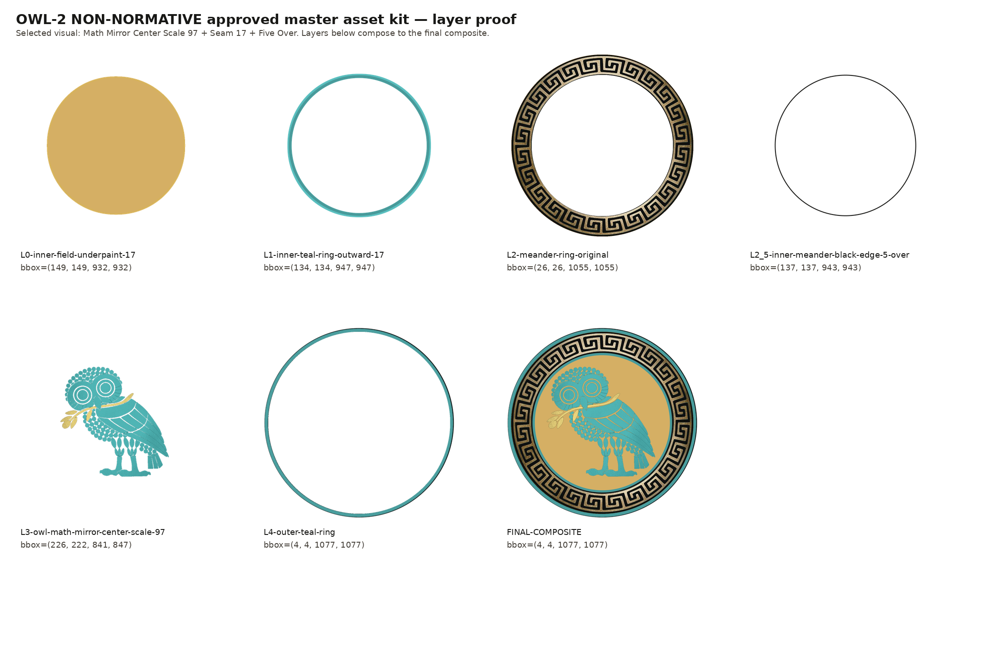

# OWL SEMAPHORE — NON-NORMATIVE STANDARD SPECIFICATION

## OWL 2 / NON-NORMATIVE / Reflection State (σᵥ)

### Version 3.0.0 (document subordinate to v3.0.0)

---

## 1. Statement of Intent

This document defines the **NON-NORMATIVE owl** as a formal epistemic state within the Owl Semaphore system.

This is not a decorative variation of the normative mark. It is a mathematically defined reflection state with a specific role in analysis, interpretation, and structured disagreement.

The goal is to preserve rigor while allowing controlled deviation from the baseline framework.

---

## 1A. The Story Before the Math — *Da Vinci's Wings*

> **T = σᵥ &nbsp;·&nbsp; det = −1 &nbsp;·&nbsp; (x, y) → (−x, y)**

Stand in front of a mirror. You are still upright — up is still up, down is still down — but left and right have swapped. That is a vertical-axis reflection: (x, y) → (−x, y). Not a rotation — a mirror image.

When Leonardo da Vinci spent years studying birds and sketching wing mechanics — preserved in the *Codex on the Flight of Birds* and related manuscripts now held by the Biblioteca Reale di Torino ([Library of Congress, *Codex on the Flight of Birds*](https://www.loc.gov/item/2021667428/); [Smithsonian Air and Space, "Leonardo da Vinci's Codex on the Flight of Birds"](https://airandspace.si.edu/multimedia-gallery/leonardo-da-vincis-codex-flight-birds)) — he was facing the other direction from the prevailing assumption that powered human flight was beyond reach. His machines did not become practical aircraft. What he left behind was a rigorous exploratory record: anatomical observation, geometric reasoning, and structured speculation.

The first powered, sustained, controlled heavier-than-air flight is attributed to the Wright Brothers at Kitty Hawk on 17 December 1903 ([Library of Congress, Wright Brothers collection](https://www.loc.gov/collections/wilbur-and-orville-wright-papers/about-this-collection/); [Smithsonian National Air and Space Museum, *1903 Wright Flyer*](https://airandspace.si.edu/collection-objects/1903-wright-flyer/nasm_A19610048000)). That success arrived four centuries after Leonardo, inside an accumulated aeronautical history of gliders, propulsion experiments, and aerodynamic theory — not as a direct line from his notebooks, but inside the broader practice of non-normative work that had matured into something actionable. The historical claim made here is the modest one: structured, rigorous exploration that has not yet succeeded is still part of the engine of progress.

The NON-NORMATIVE owl marks that posture — the mirror state, facing what the canonical view has its back to, **without claiming to have replaced the canonical view yet.** It is reflection, not rejection. Non-normative work is the engine of progress: rigorous exploration that has not finished yet.

**Bridge — from the story to the operator.** The mirror in *Da Vinci's Wings* is a precise statement of the formal mapping, not a metaphor laid over it. Standing upright while left and right swap is exactly the vertical-axis reflection **σᵥ**: (x, y) → (−x, y), determinant −1 (§4). The "still upright" part matters — σᵥ *preserves the vertical reference* (up stays up) while reversing the lateral stance; that is why NON-NORMATIVE is an *alternative orientation* to the baseline, not its negation or its inversion (the full inversion is CRITICAL's C₂). Leonardo facing the direction the prevailing view had its back to — rigorous, structured, not yet successful — *is* what the reflected determinant encodes: **legitimate exploration, not failure and not error**. The det = −1 marks orientation reversal; it does not mark wrongness. Read the story as the intuition and §4 as its formalization; they are the same claim at two resolutions.

This story is the human-intuition bridge to the mathematical formalism in §§2 onward. The deliberate ordering is story → transform → scientific use → objections/verification, so a reader who would argue the σᵥ state from intuition, from history-of-science, or from the V₄ algebra can each enter through the right door.

---

## 2. System Context

The Owl Semaphore system is defined by the Klein four-group:

$$
V_4 = \{I, \sigma_v, C_2, \sigma_h\}
$$

The NON-NORMATIVE owl corresponds to the vertical reflection operator:

$$
\sigma_v : (x,y) \mapsto (-x,y)
$$

---

## 3. Ontological Role

### 3.1 Semantic Designation

NON-NORMATIVE represents:

- legitimate alternative interpretation
- reflective critique
- analytical deviation
- structured disagreement

### 3.2 Interpretive Role

This state indicates that the content:

- departs from the canonical model
- remains structurally grounded in the same system
- is not arbitrary or invalid

### 3.3 What It Does Not Mean

- not random
- not incorrect by default
- not adversarial (that is CRITICAL)

It is **reflection**, not rejection.

---

## 4. Mathematical Definition

### 4.1 State Operator

$$
T_{\text{non}} = \sigma_v
$$

### 4.2 Matrix Form

$$
\sigma_v =
\begin{bmatrix}
-1 & 0 \\
0 & 1
\end{bmatrix}
$$

### 4.3 Determinant

$$
\det(\sigma_v) = -1
$$

### 4.4 Properties

- orientation-reversing
- reflection class
- order 2

$$
\sigma_v^2 = I
$$

---

## 5. Coordinate System

The NON-NORMATIVE state uses the same coordinate system as NORMATIVE:

- canvas: 1080 × 1080
- center: (540, 540)

Transformation is applied relative to this center.

---

## 6. Canonical Orientation

### 6.1 Visual Definition

- upright
- faces LEFT

### 6.2 Transform Relationship

The NON-NORMATIVE owl is the horizontal mirror of the normative owl.

---

## 7. Asset Topology

Layer structure is identical to normative:

- L1 — inner field
- L2 — meander ring
- L3 — owl body
- L4 — outer ring

### 7.1 Composite Definition

$$
N_{\text{non}} = L_1 \oplus L_2 \oplus L_3 \oplus L_4
$$

---

## 8. Geometry

All geometric constraints are inherited from the normative standard:

- identical radii
- identical center
- identical annular structure

No geometric deformation is permitted.

---

## 9. Color Specification

### 9.1 Palette

- outer ring: #316964 (teal)
- owl: #316964 (teal)
- field: #d2d8d6 (cool gray)
- meander: unchanged (gold)

### 9.2 Color Doctrine

Teal represents analytical distance from the normative baseline while maintaining structural coherence.

---

## 10. Transparency and Alpha

Same rules as normative:

- RGBA required
- corner alpha = 0
- center alpha = 255

---

## 11. Provenance

### 11.1 Construction

Derived from normative by:

- horizontal reflection
- no rotation
- no scaling

### 11.2 Transform Integrity

The transform must be exact. Any distortion invalidates the state.

---

## 12. Asset Invariants

### 12.1 Algebraic

- operator = σᵥ
- determinant = -1

### 12.2 Visual

- upright
- mirrored orientation

### 12.3 Structural

- geometry unchanged
- layer structure unchanged

---

## 13. Integrity Regime

All assets must:

- pass SHA-3-512 verification
- be reproducible from layers

---

## 14. Interpretation Rules

### 14.1 Positive Rule

When present:

The content reflects the normative framework while offering a structured alternative.

### 14.2 Negative Rule

It does not indicate failure or error.

---

## 15. Non-Permitted Changes

- rotation
- vertical flip
- C2 inversion
- geometry alteration

---

## 16. Relationship to Other States

- NORMATIVE → identity (*"This is the standard."*)
- NON-NORMATIVE → reflection (*"This reflects the standard."*)
- CRITICAL → inversion (*"This inverts the standard."*)
- METACOGNITIVE → frame-audit (*"The observer audits the frame."* — thinking examines its own frame)

---

## 17. Formal Definition

Let L₁–L₄ be the layer fields.

$$
N_{\text{non}} = L_1 \oplus L_2 \oplus L_3 \oplus L_4
$$

with

$$
T = \sigma_v
$$

---

## 17A. Limitations and Scope

The NON-NORMATIVE state carries a specific misuse risk: it must never be read as a verdict of "wrong." σᵥ reverses orientation (det = −1), not correctness — the state marks a *legitimate alternative facing*, and the whole reason it exists as a distinct, protected state is to keep structured exploration and dissent from collapsing into "not normative" and being dismissed (see the use-boundaries in §1C.1 of [`OWL-SEMAPHORE-EXPLANATION.md`](OWL-SEMAPHORE-EXPLANATION.md)). Tagging an analysis NON-NORMATIVE to sideline it, rather than to describe the reflective move actually performed, is a misuse. Like the system as a whole, this is a coarse four-way stance classifier (see §12A of [`OWL-SEMAPHORE-SYSTEM.md`](OWL-SEMAPHORE-SYSTEM.md)): it does not grade how promising the exploration is, its epistemic reliability across annotators is not yet empirically validated, and applying the badge is itself a contestable evaluative act.

---

## 18. Closing Statement

The NON-NORMATIVE owl preserves system integrity while enabling structured deviation.

It is the mechanism by which the system permits disagreement without collapse.
