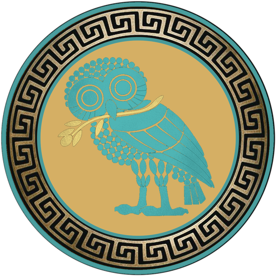

# OWL SEMAPHORE — NON-NORMATIVE STANDARD SPECIFICATION

## OWL 2 / NON-NORMATIVE / Reflection State (σᵥ)

### Version 2.0.0-rc (release candidate; document subordinate to v2.0.0-rc)

---

## 1. Da Vinci's Wings

**State line:** NON-NORMATIVE — *T = σᵥ*, det = −1, (x, y) ↦ (−x, y)

Stand in front of a mirror. You are still upright — up is still up, down is still down — but left and right have swapped. That is a vertical-axis reflection: (x, y) ↦ (−x, y). Not a rotation — a mirror image.

When Leonardo da Vinci spent years studying birds, sketching wing mechanics, and building machines that could not fly, he was a Non-Normative owl. Facing the other direction. Seeing what everyone else had their backs to. He failed, but he left the rest of the world a guideline for success. The Wright Brothers stood on his shoulders 400 years later. Non-normative work is the engine of progress: rigorous exploration that hasn't finished yet.

> This section is **orientation, not proof.** The formal scientific object remains the reflection operator *σᵥ*, with determinant −1 and coordinate action (x, y) ↦ (−x, y). The story above is the plain-English meaning of that operator; the operator itself is defined formally in §5 (Mathematical Definition).

---

## 2. Statement of Intent

This document defines the **NON-NORMATIVE owl** as a formal epistemic state within the Owl Semaphore system.

This is not a decorative variation of the normative mark. It is a mathematically defined reflection state with a specific role in analysis, interpretation, and structured disagreement.

The goal is to preserve rigor while allowing controlled deviation from the baseline framework.

---

## 3. System Context

The Owl Semaphore system is defined by the Klein four-group:

$$
V_4 = \{I, \sigma_v, C_2, \sigma_h\}
$$

The NON-NORMATIVE owl corresponds to the vertical reflection operator:

$$
\sigma_v : (x,y) \mapsto (-x,y)
$$

---

## 4. Ontological Role

### 4.1 Semantic Designation

NON-NORMATIVE represents:

- legitimate alternative interpretation
- reflective critique
- analytical deviation
- structured disagreement

### 4.2 Interpretive Role

This state indicates that the content:

- departs from the canonical model
- remains structurally grounded in the same system
- is not arbitrary or invalid

### 4.3 What It Does Not Mean

- not random
- not incorrect by default
- not adversarial (that is CRITICAL)

It is **reflection**, not rejection.

---

## 5. Mathematical Definition

### 5.1 State Operator

$$
T_{\text{non}} = \sigma_v
$$

### 5.2 Matrix Form

$$
\sigma_v =
\begin{bmatrix}
-1 & 0 \\
0 & 1
\end{bmatrix}
$$

### 5.3 Determinant

$$
\det(\sigma_v) = -1
$$

### 5.4 Properties

- orientation-reversing
- reflection class
- order 2 (self-inverse involution)

$$
\sigma_v \circ \sigma_v = I
$$

---

## 6. Coordinate System

The NON-NORMATIVE state uses the same coordinate system as NORMATIVE:

- canvas: 1080 × 1080
- center: (540, 540)

Transformation is applied relative to this center.

---

## 7. Canonical Orientation

### 7.1 Visual Definition

- upright
- faces LEFT

### 7.2 Transform Relationship

The NON-NORMATIVE owl is the horizontal mirror of the normative owl.

---

## 8. Asset Topology

The approved Math-Mirror Center-Scale-97 master extends the four-layer
NORMATIVE topology with two seam-refinement layers:

- L0 — inner field underpaint (17 px)
- L1 — inner teal ring outward (17 px)
- L2 — meander ring (original, shared with NORMATIVE)
- L2.5 — inner meander black edge (5 px over)
- L3 — owl body (math-mirror center-scale-97)
- L4 — outer teal ring

L2.5 and the 17-px seam treatments in L0/L1 are presentation-layer
refinements to maintain legibility on the dark inner field; they do not
enter the V₄ transform. The mathematical state operator remains σᵥ.

### 8.1 Composite Definition

$$
N_{\text{non}} = L_0 \oplus L_1 \oplus L_2 \oplus L_{2.5} \oplus L_3 \oplus L_4
$$

---

## 9. Geometry

All geometric constraints are inherited from the normative standard:

- identical radii
- identical center
- identical annular structure

No geometric deformation is permitted.

---

## 10. Color Specification

### 10.1 Palette

The approved Math-Mirror Center-Scale-97 + Seam-17 + Five-Over master uses
the following palette on the dark inner field:

- owl: teal — observed dominant RGB **(77, 177, 176)** ≈ `#4DB1B0`
- outer ring: teal — same family as the owl, recolored from the geometry layer
- meander: gold (unchanged, shared with NORMATIVE)
- inner field: dark slate (carried over from the L0 inner-field underpaint)

The full reviewed provenance for these layers (L0 inner-field underpaint 17, L1
inner teal ring outward 17, L2 meander ring original, L2.5 inner meander
black edge 5-over, L3 owl math-mirror center-scale-97, L4 outer teal ring)
lives in `assets/v2/nonnormative-math97-five-over-master/`.

### 10.2 Color Doctrine

Teal represents analytical distance from the normative baseline while maintaining structural coherence. The brighter teal used in the approved Math-Mirror Center-Scale-97 master is calibrated for legibility against the dark inner field, mirroring the parchment-tone rationale used for NORMATIVE.

---

## 11. Transparency and Alpha

Same rules as normative:

- RGBA required
- corner alpha = 0
- center alpha = 255

---

## 12. Provenance

### 12.1 Construction

The approved master is the human-reviewed **Math-Mirror Center-Scale-97 +
Seam-17 + Five-Over** composite, staged in
`assets/v2/nonnormative-math97-five-over-master/`. Its layer order is:

1. L0 — inner field underpaint 17
2. L1 — inner teal ring outward 17
3. L2 — meander ring original (shared geometry with NORMATIVE)
4. L2.5 — inner meander black edge 5 over (seam refinement)
5. L3 — owl math-mirror center-scale-97 (vertical-axis mirror of the source owl, then re-centered and scaled to 97 %)
6. L4 — outer teal ring

The owl-only L3 is the visual mathematical master for NON-NORMATIVE. It is
*close to* but not bit-for-bit identical with `σᵥ(NORMATIVE)` because of
the 97 % re-scale and the seam refinements introduced for legibility on
the dark inner field. The asset was promoted only after explicit human
visual approval; the source TIFF, all six layers, and the audit JSON are
preserved verbatim under the master kit directory for future review.

### 12.2 Transform Integrity

The state's *formal* operator remains σᵥ with determinant −1. The visual
master is a presentation-layer asset built from σᵥ-derived owl geometry
plus reviewed seam refinements; the algebra of the state system is
unchanged. The full audit trail (per-layer SHA-256, diff-bbox check against
the user-approved proof) lives in
`assets/v2/nonnormative-math97-five-over-master/metrics/OWL-2-NON-NORMATIVE-MATH97-FIVE-OVER-METRICS.json`.

---

## 13. Asset Invariants

### 13.1 Algebraic

- operator = σᵥ
- determinant = -1

### 13.2 Visual

- upright
- mirrored orientation

### 13.3 Structural

- geometry unchanged
- layer structure unchanged

---

## 14. Integrity Regime

All assets must:

- pass SHA-3-512 verification
- be reproducible from layers

---

## 15. Interpretation Rules

### 15.1 Positive Rule

When present:

The content reflects the normative framework while offering a structured alternative.

### 15.2 Negative Rule

It does not indicate failure or error.

---

## 16. Non-Permitted Changes

- rotation
- vertical flip
- C2 inversion
- geometry alteration

---

## 17. Relationship to Other States

- NORMATIVE → identity (*"This is the standard."*)
- NON-NORMATIVE → reflection (*"This reflects the standard."*)
- CRITICAL → inversion (*"This inverts the standard."*)
- METACOGNITIVE → frame-audit (*"The observer audits the frame."* — thinking examines its own frame)

---

## 18. Formal Definition

Let L₁–L₄ be the layer fields.

$$
N_{\text{non}} = L_1 \oplus L_2 \oplus L_3 \oplus L_4
$$

with

$$
T = \sigma_v
$$

---

## 19. Closing Statement

The NON-NORMATIVE owl preserves system integrity while enabling structured deviation.

It is the mechanism by which the system permits disagreement without collapse.
