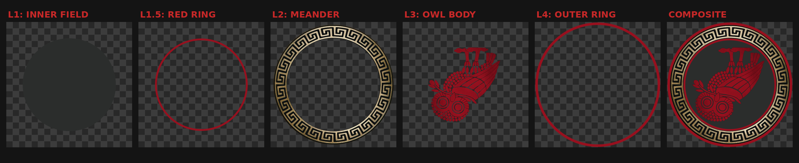

# OWL SEMAPHORE — CRITICAL STANDARD SPECIFICATION

## OWL 3 / CRITICAL / Inversion State (C₂)

### Version 1.0 Draft

---

## 1. Statement of Intent

This document defines the **CRITICAL owl** as the inversion state within the Owl Semaphore system.

This is not a stylistic warning label. It is a mathematically defined operator corresponding to full inversion of the evaluative frame.

The purpose of this state is to enable structured adversarial analysis without ambiguity.

---

## 2. System Context

The Owl Semaphore is defined by the Klein four-group:

$$
V_4 = \{I, \sigma_v, C_2, \sigma_h\}
$$

The CRITICAL owl corresponds to the 180° rotation operator:

$$
C_2 : (x,y) \mapsto (-x,-y)
$$

---

## 3. Ontological Role

### 3.1 Semantic Designation

CRITICAL represents:

- adversarial analysis
- falsification
- structural inversion of assumptions
- red-team evaluation

### 3.2 Interpretive Role

This state indicates that the content has been examined under conditions where all baseline assumptions are treated as potentially invalid.

### 3.3 What It Does Not Mean

- not emotional alarm
- not stylistic emphasis
- not rhetorical attack

It is **structured inversion**, not reaction.

---

## 4. Mathematical Definition

### 4.1 State Operator

$$
T_{\text{crit}} = C_2
$$

### 4.2 Matrix Form

$$
C_2 =
\begin{bmatrix}
-1 & 0 \\
0 & -1
\end{bmatrix}
$$

### 4.3 Determinant

$$
\det(C_2) = +1
$$

### 4.4 Properties

- orientation-preserving
- inversion via rotation
- order 2

$$
C_2^2 = I
$$

---

## 5. Coordinate System

Same as normative:

- canvas: 1080 × 1080
- center: (540, 540)

Transformation is applied relative to the center.

---

## 6. Canonical Orientation

### 6.1 Visual Definition

- upside down
- faces LEFT

### 6.2 Transform Relationship

The CRITICAL owl is the result of rotating the normative owl by 180°.

---

## 7. Asset Topology

Layer structure is identical:

- L1 — inner field
- L2 — meander ring
- L3 — owl body
- L4 — outer ring

### 7.1 Composite Definition

$$
N_{\text{crit}} = L_1 \oplus L_2 \oplus L_3 \oplus L_4
$$

---

## 8. Geometry

All geometric constraints are inherited from the normative standard.

### 8.1 Critical Owl Clipping Rule

The owl body (L3) is clipped at a slightly larger radius than normative to expose an inner red ring.

This produces a visible:

red → black → red

layer boundary structure.

This is a distinguishing invariant of the CRITICAL state.

---

## 9. Color Specification

### 9.1 Palette

- outer ring: #990f1e (red)
- owl: #990f1e (red)
- field: #8c121c (warm red)
- meander: unchanged

### 9.2 Color Doctrine

Red is used because it is the most physiologically activating color and universally signals attention and scrutiny.

### 9.3 Contrast Constraint

The red-on-red contrast is intentionally low relative to other states.

This forces deliberate inspection rather than passive recognition.

---

## 10. Transparency and Alpha

Same as normative:

- RGBA required
- corner alpha = 0
- center alpha = 255

---

## 11. Provenance

### 11.1 Construction

Derived from normative by:

- 180° rotation
- controlled clipping of owl layer

### 11.2 Transform Integrity

No additional transforms permitted.

---

## 12. Asset Invariants

### 12.1 Algebraic

- operator = C₂
- determinant = +1

### 12.2 Visual

- fully inverted orientation
- left-facing

### 12.3 Structural

- geometry preserved
- clipping rule applied

---

## 13. Integrity Regime

All assets must:

- pass SHA-3-512 verification
- be reproducible from layers

---

## 14. Interpretation Rules

### 14.1 Positive Rule

When present:

The content has been subjected to adversarial or falsification-oriented analysis.

### 14.2 Negative Rule

It does not imply that the content is incorrect.

---

## 15. Non-Permitted Changes

- partial rotation
- reflection instead of rotation
- removal of clipping rule
- color substitution outside red spectrum

---

## 16. Relationship to Other States

- NORMATIVE → baseline
- NON-NORMATIVE → reflection
- CRITICAL → inversion
- METACOGNITIVE → observer audit

---

## 17. Formal Definition

Let L₁–L₄ be the layer fields.

$$
N_{\text{crit}} = L_1 \oplus L_2 \oplus L_3 \oplus L_4
$$

with

$$
T = C_2
$$

---

## 18. Closing Statement

The CRITICAL owl enforces structured inversion without collapse.

It is the mechanism by which the system challenges itself while remaining coherent.
