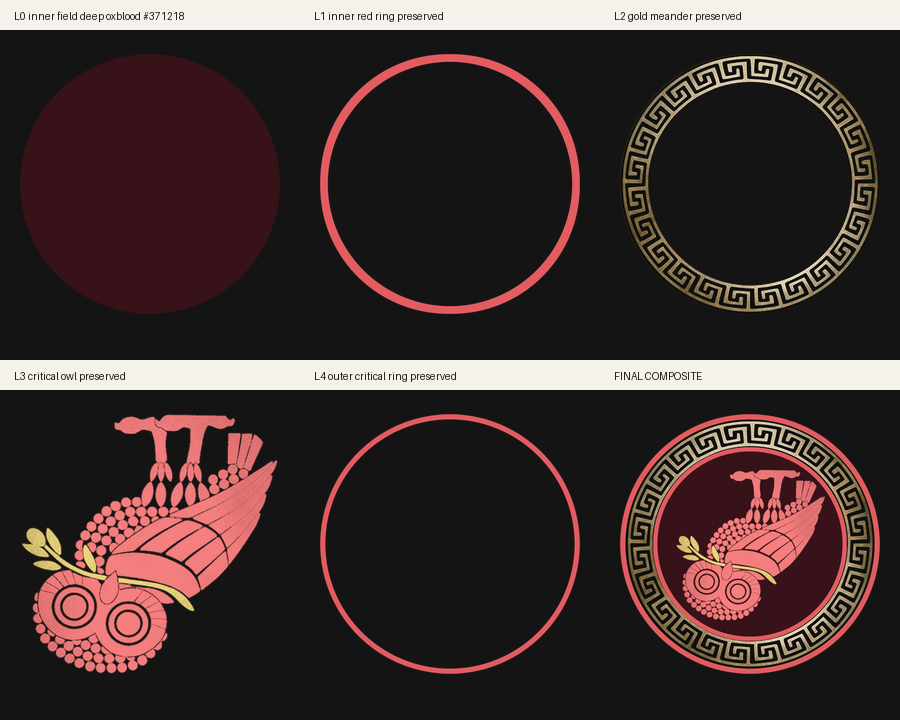

# OWL SEMAPHORE — CRITICAL STANDARD SPECIFICATION

## OWL 3 / CRITICAL / Inversion State (C₂)

### Version 2.0.0 (document subordinate to v2.0.0)

---

## 1. Statement of Intent

This document defines the **CRITICAL owl** as the inversion state within the Owl Semaphore system.

This is not a stylistic warning label. It is a mathematically defined operator corresponding to full inversion of the evaluative frame.

The purpose of this state is to enable structured adversarial analysis without ambiguity.

---

## 1A. The Story Before the Math — *The Manhattan Moment*

> **T = C₂ &nbsp;·&nbsp; det = +1 &nbsp;·&nbsp; (x, y) → (−x, −y)**

Do a handstand. Both axes flip — left becomes right, up becomes down. (x, y) → (−x, −y). The blood rushes to your head. You cannot hold it for long. That is the Critical state: total inversion under pressure.

During the Manhattan Project, physicists examined a catastrophic hypothesis raised by Edward Teller — whether a nuclear detonation could ignite the Earth's atmosphere or oceans. The question was studied formally in a 1946 Los Alamos report (LA-602) by Konopinski, Marvin, and Teller, which concluded the ignition scenario was not possible under the conditions of the planned device; the matter was revisited in later historical analysis ([Konopinski, Marvin, Teller, *Ignition of the Atmosphere with Nuclear Bombs*, LA-602, 1946 (Los Alamos)](https://sgp.fas.org/othergov/doe/lanl/docs1/00329010.pdf); see also [Reines, "The Early Days of Experimental Neutrino Physics," *Science*, 1979](https://www.science.org/doi/10.1126/science.203.4375.11) and historical review in [Rhodes, *The Making of the Atomic Bomb*, 1986, ch. 16](https://www.simonandschuster.com/books/The-Making-of-the-Atomic-Bomb/Richard-Rhodes/9781451677614)). The concern was examined and ruled out, not expected. The discipline here is the point: even a vanishingly unlikely catastrophic hypothesis must be **resolved** before action, not waved away.

That is the Critical posture. Not because the analysis is wrong; because your own proof, taken seriously, has reversed your position and the situation demands a structured resolution before you proceed.

The same shape recurs across fields under different names:

- **Psychiatry** calls the experience of an internally generated but unwanted thought *ego-dystonic* ([American Psychiatric Association, *DSM-5-TR*, glossary entry "ego-dystonic"](https://www.psychiatry.org/psychiatrists/practice/dsm); [APA Dictionary of Psychology, "ego-dystonic"](https://dictionary.apa.org/ego-dystonic)).
- **Philosophy** calls impasse *aporia* ([Stanford Encyclopedia of Philosophy, "Aporia"](https://plato.stanford.edu/entries/socratic-method/)).
- **Engineering** calls it a *show-stopper*.
- **Cybersecurity** calls it a *0-day* — an unpatched, actively exploitable vulnerability whose disclosure window has not opened ([CISA, "Known Exploited Vulnerabilities Catalog"](https://www.cisa.gov/known-exploited-vulnerabilities-catalog); [NIST, *Zero-day vulnerability* glossary entry](https://csrc.nist.gov/glossary/term/zero_day_attack)).

The CRITICAL owl is inverted because your own proof has reversed your position — and the system needs to be told, visibly, that adversarial analysis or falsification has been applied. The mark says "this has been examined under inversion," not "this is wrong."

This story is the human-intuition bridge to the mathematical formalism in §§2 onward. The deliberate ordering is story → transform → scientific use → objections/verification, so a reader who would argue this state from incident response, from formal logic, or from clinical/cognitive grounds can each enter through the right door.

---

## 2. System Context

The Owl Semaphore is defined by the Klein four-group:

$$
V_4 = \{I, \sigma_v, C_2, \sigma_h\}
$$

The CRITICAL owl corresponds to the 180° rotation operator:

$$
C_2 : (x,y) \mapsto (-x,-y)
$$

---

## 3. Ontological Role

### 3.1 Semantic Designation

CRITICAL represents:

- adversarial analysis
- falsification
- structural inversion of assumptions
- red-team evaluation

### 3.2 Interpretive Role

This state indicates that the content has been examined under conditions where all baseline assumptions are treated as potentially invalid.

### 3.3 What It Does Not Mean

- not emotional alarm
- not stylistic emphasis
- not rhetorical attack

It is **structured inversion**, not reaction.

---

## 4. Mathematical Definition

### 4.1 State Operator

$$
T_{\text{crit}} = C_2
$$

### 4.2 Matrix Form

$$
C_2 =
\begin{bmatrix}
-1 & 0 \\
0 & -1
\end{bmatrix}
$$

### 4.3 Determinant

$$
\det(C_2) = +1
$$

### 4.4 Properties

- orientation-preserving
- inversion via rotation
- order 2

$$
C_2^2 = I
$$

---

## 5. Coordinate System

Same as normative:

- canvas: 1080 × 1080
- center: (540, 540)

Transformation is applied relative to the center.

---

## 6. Canonical Orientation

### 6.1 Visual Definition

- upside down
- faces LEFT

### 6.2 Transform Relationship

The CRITICAL owl is the result of rotating the normative owl by 180°.

---

## 7. Asset Topology

Layer structure is identical:

- L1 — inner field
- L2 — meander ring
- L3 — owl body
- L4 — outer ring

### 7.1 Composite Definition

$$
N_{\text{crit}} = L_1 \oplus L_2 \oplus L_3 \oplus L_4
$$

---

## 8. Geometry

All geometric constraints are inherited from the normative standard.

### 8.1 Critical Owl Clipping Rule

The owl body (L3) is clipped at a slightly larger radius than normative to expose an inner red ring.

This produces a visible:

red → black → red

layer boundary structure.

This is a distinguishing invariant of the CRITICAL state.

---

## 9. Color Specification

### 9.1 Palette

- outer ring: #990f1e (red)
- owl: #990f1e (red)
- field: #8c121c (warm red)
- meander: unchanged

### 9.2 Color Doctrine

Red is used because it is the most physiologically activating color and universally signals attention and scrutiny.

### 9.3 Contrast Constraint

The red-on-red contrast is intentionally low relative to other states.

This forces deliberate inspection rather than passive recognition.

### 9.4 Accessibility — Color Is Not the Only Carrier

The CRITICAL palette is intentionally close to a red-on-red regime, which would be unrecoverable for users with red-axis (protan) color vision deficiency if color were the only carrier of state identity ([PMC global CVD review, 12385717](https://pmc.ncbi.nlm.nih.gov/articles/PMC12385717/)). Therefore, in v2.0.0 the system explicitly requires that CRITICAL identity be perceptually recoverable from at least three independent channels:

1. **color** (red palette)
2. **orientation** (upside-down, left-facing — defined by C₂)
3. **textual label and context** (the literal token `CRITICAL` and the supporting math/quote tuple printed alongside the badge)

This triple-redundant encoding (color + orientation + label) is the project's design response to WCAG 2.2 SC 1.4.1 (Use of Color), which prohibits color from being the sole means of conveying information ([WCAG 2.2 SC 1.4.1](https://www.w3.org/WAI/WCAG22/Understanding/use-of-color.html)), and to Section 508 §302.3 ([Section 508](https://www.section508.gov/create/making-color-usage-accessible/)). The contrast invariant remains intentionally tight; the accessibility guarantee comes from the redundancy across channels, not from softening the color.

---

## 10. Transparency and Alpha

Same as normative:

- RGBA required
- corner alpha = 0
- center alpha = 255

---

## 11. Provenance

### 11.1 Construction

Derived from normative by:

- 180° rotation
- controlled clipping of owl layer

### 11.2 Transform Integrity

No additional transforms permitted.

---

## 12. Asset Invariants

### 12.1 Algebraic

- operator = C₂
- determinant = +1

### 12.2 Visual

- fully inverted orientation
- left-facing

### 12.3 Structural

- geometry preserved
- clipping rule applied

---

## 13. Integrity Regime

All assets must:

- pass SHA-3-512 verification
- be reproducible from layers

---

## 14. Interpretation Rules

### 14.1 Positive Rule

When present:

The content has been subjected to adversarial or falsification-oriented analysis.

### 14.2 Negative Rule

It does not imply that the content is incorrect.

---

## 15. Non-Permitted Changes

- partial rotation
- reflection instead of rotation
- removal of clipping rule
- color substitution outside red spectrum

---

## 16. Relationship to Other States

- NORMATIVE → baseline (*"This is the standard."*)
- NON-NORMATIVE → reflection (*"This reflects the standard."*)
- CRITICAL → inversion (*"This inverts the standard."*)
- METACOGNITIVE → frame-audit (*"The observer audits the frame."* — thinking examines its own frame)

---

## 17. Formal Definition

Let L₁–L₄ be the layer fields.

$$
N_{\text{crit}} = L_1 \oplus L_2 \oplus L_3 \oplus L_4
$$

with

$$
T = C_2
$$

---

## 18. Closing Statement

The CRITICAL owl enforces structured inversion without collapse.

It is the mechanism by which the system challenges itself while remaining coherent.
