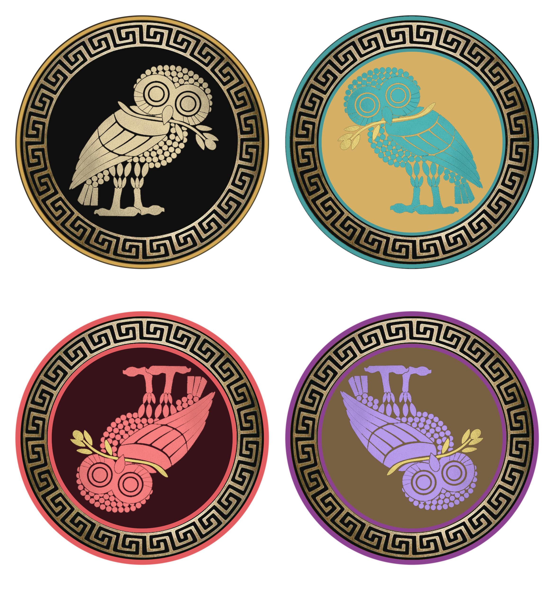

# OWL SEMAPHORE — SYSTEM SPECIFICATION
A finite algebra over epistemic states, implemented as a reproducible visual notation system with enforced invariants.
## Version 1.3.0-rc (release candidate)

---

## 1. Statement of Intent

This document defines the Owl Semaphore as a formal epistemic system grounded in mathematics, perception, and reproducible graphical structure.

This is not a taxonomy of labels. It is a closed algebra over epistemic states, mapped into a constrained visual notation system.

The objective is a system that is:

- mathematically coherent
- visually invariant
- epistemically meaningful
- operationally reproducible
- resistant to ambiguity and drift

### 1.1 Canonical Sentence Stack (v1.3.0-rc)

The project uses a three-layer canonical sentence stack so that the same concept can be expressed at the level of mathematics, operation, and human story without drifting between documents:

| Layer | Canonical sentence | Use |
| --- | --- | --- |
| Formal | *A finite algebra over epistemic states, implemented as a reproducible visual notation system with enforced invariants.* | README, system spec, Zenodo metadata draft, citation abstract |
| Operational | *A four-state visual system for marking how a claim, document, dataset, or finding should be evaluated before belief, challenge, or action.* | Explanation document, public overview, DNS Tool bridge |
| Human | *Four owls tell the reader what kind of thinking they are looking at: standard, exploration, inversion, or self-audit.* | Story sections, teaching material |

Earlier inconsistent forms — *"mapped into a visual system with strict invariants"* (former §11) and *"implemented as a reproducible visual system with enforced invariants"* (former README masthead) — are reconciled in v1.3.0-rc onto the canonical formal sentence above.

---

## 2. Mathematical Foundation

### 2.1 Group Definition

The Owl Semaphore's discrete state space is modeled as the Klein four-group:

$$
V_4 = \{I, \sigma_v, C_2, \sigma_h\}
$$

This is a finite subgroup of the orthogonal group \(O(2)\) isomorphic to V₄ (equivalently the dihedral group D₂); it is not O(2) itself ([Klein four-group, Wikipedia](https://en.wikipedia.org/wiki/Klein_four-group); [nLab](https://ncatlab.org/nlab/show/Klein+four-group); [Knill, Harvard Math 22b, Unit 8: O(2)](https://people.math.harvard.edu/~knill/teaching/math22b2019/handouts/lecture08.pdf)).

### 2.2 Elements

| State | Operator | Mapping | Determinant |
|------|--------|--------|------------|
| NORMATIVE | I | (x,y) → (x,y) | +1 |
| NON-NORMATIVE | σᵥ | (x,y) → (-x,y) | -1 |
| CRITICAL | C₂ | (x,y) → (-x,-y) | +1 |
| METACOGNITIVE | σₕ | (x,y) → (x,-y) | -1 |

The σₕ assignment to METACOGNITIVE is unchanged from v1.2.0. Only the interpretive wording is refined in v1.3.0-rc (see §4).

### 2.3 Closure (Cayley Table)

The system is closed under composition. The Cayley table is:

| ∘ | I | σᵥ | C₂ | σₕ |
| --- | --- | --- | --- | --- |
| **I** | I | σᵥ | C₂ | σₕ |
| **σᵥ** | σᵥ | I | σₕ | C₂ |
| **C₂** | C₂ | σₕ | I | σᵥ |
| **σₕ** | σₕ | C₂ | σᵥ | I |

Each element is its own inverse: \(g^2 = I\) for all \(g \in V_4\). The four group axioms (closure, associativity, identity, inverses) hold by the table above.

### 2.4 Interpretation

This closure is not decorative. It enforces that all epistemic transitions remain inside a defined state space. Group structure guarantees algebraic closure; it does not by itself guarantee security or behavioral correctness without further proof.

---

## 3. State vs Process

### 3.1 Discrete States

The four owls represent discrete epistemic states:

- identity (NORMATIVE)
- reflection (NON-NORMATIVE)
- inversion (CRITICAL)
- frame-audit (METACOGNITIVE)

### 3.2 Continuous Process

Not all operations belong to the state system.

### 3.3 The 31° Rotation

The measured ~31° rotation is not part of V₄.

- it is not closed
- repeated composition does not return to the set

It represents **process**, not state.

### 3.4 Principle

States classify position.
Processes move between positions.

---

## 4. Epistemic Model

### 4.1 Core Structure

The system separates three levels:

1. object of analysis
2. observer
3. evaluative frame

### 4.2 State Mapping (Normative Phrasing — v1.3.0-rc)

| State | Quote (scientific / normative) | Meaning |
|------|--------|--------|
| NORMATIVE | *"This is the standard."* | baseline framework |
| NON-NORMATIVE | *"This reflects the standard."* | reflected interpretation |
| CRITICAL | *"This inverts the standard."* | inverted assumptions |
| METACOGNITIVE | *"The observer audits the frame."* | observer audits its own evaluative frame — thinking about thinking |

> **Note on the METACOGNITIVE phrasing.** The earlier line *"This audits the standard"* is deprecated as of v1.3.0-rc. The audit at METACOGNITIVE is directed at the **observer's own evaluative frame**, not at the standard as an external object. The explanatory variant — *"Thinking examines its own frame"* — appears in the warmer-voiced [OWL-SEMAPHORE-EXPLANATION.md](OWL-SEMAPHORE-EXPLANATION.md). This refinement aligns the language with the cognitive-science meaning of metacognition: monitoring and regulation of one's own cognitive process ([metacognitive reflection review, PMC 11368986](https://pmc.ncbi.nlm.nih.gov/articles/PMC11368986/)).

### 4.3 Critical Distinction

The system is only valid if these states are not conflated.

---

## 5. Physical Grounding

The system is grounded in observable behavior.

### 5.1 Canonical Example

The METACOGNITIVE state is physically instantiated by:

- searching a space normally
- failing to detect a target
- inverting the viewing frame

### 5.2 Interpretation

The object does not change.
The observer does not change as an agent.
The frame changes.

In short: the observer audits the frame.

---

## 6. Visual System Mapping

### 6.1 Shared Geometry

All owls share:

- identical center
- identical radial structure
- identical meander ring

### 6.2 Transform Consistency

Each owl is derived from the normative form by a valid element of V₄.

No arbitrary transformations are permitted.

### 6.3 Invariants

- geometry is fixed
- center is fixed
- ring structure is fixed

---

## 7. Color System and Accessibility

Each state is assigned a distinct color space region:

- gold → normative authority
- teal → analytical reflection
- red → adversarial inversion
- amethyst → introspective frame-audit

### 7.1 Constraint

Color is semantic, not decorative.

### 7.2 Accessibility — Triple-Redundant Encoding (v1.3.0-rc, normative)

**Color is not the only carrier.** State identity must remain recoverable when color is removed (grayscale rendering, color vision deficiency, or low-vision contexts). Every state in the Owl Semaphore is therefore encoded through at least three independent channels:

1. **color** (the palette assigned in §7)
2. **orientation** (the V₄ transform applied to the canonical owl: upright/inverted × right/left-facing)
3. **textual label and context** (the literal state token — `NORMATIVE`, `NON-NORMATIVE`, `CRITICAL`, `METACOGNITIVE` — and the math/quote tuple printed alongside the badge)

This satisfies the design intent of **WCAG 2.2 SC 1.4.1 (Use of Color, Level A)**, which prohibits color from being the only visual means of conveying information ([W3C](https://www.w3.org/WAI/WCAG21/Understanding/use-of-color.html)), and aligns with Section 508 §302.3 ([Section 508.gov](https://www.section508.gov/create/making-color-usage-accessible/)). The CRITICAL state's intentionally low red-on-red contrast is the most acute test of this rule: redness alone never carries CRITICAL identity — orientation (upside-down, left-facing) and the literal label `CRITICAL` are required.

Red-green color vision deficiency affects approximately 8% of males and 0.5% of females of Northern European descent; rates vary by population ([PMC global CVD review, 12385717](https://pmc.ncbi.nlm.nih.gov/articles/PMC12385717/)).

Full WCAG 2.2 Level AA empirical conformance testing (automated checks, CVD simulation, user testing) is scoped to a future release; v1.3.0-rc states the design rule and its compliance intent.

---

## 8. Integrity Model

All assets must satisfy:

- reproducibility from layers
- RGBA transparency correctness
- cryptographic verification (SHA-3-512)

### 8.1 Principle

An asset is not valid because it looks correct.
It is valid because it verifies.

---

## 9. File and System Architecture

### 9.1 Structure

OWL-SEMAPHORE/
├── OWL-SEMAPHORE-SYSTEM.md
├── OWL-SEMAPHORE-EXPLANATION.md
├── INTEGRITY-MANIFEST.md
├── CHANGELOG.md
├── OWL-1-NORMATIVE.md
├── OWL-2-NON-NORMATIVE.md
├── OWL-3-CRITICAL.md
└── OWL-4-METACOGNITIVE.md

### 9.2 Separation of Concerns

- system rules live in the system spec
- state rules live in the four owl-specific files
- origin story and audience rationale live in the explanation document
- canonical sentence history lives in `CHANGELOG.md`

---

## 10. Interpretation Doctrine

### 10.1 The System Encodes Position, Not Truth

The Owl Semaphore does not assert correctness.

It encodes:

- how something is being evaluated
- not whether it is ultimately true

### 10.2 Misuse Condition

If the system is used to imply certainty rather than epistemic position, it is being used incorrectly.

---

## 11. Core Principle (Reconciled, v1.3.0-rc)

This system is defined as:

> **A finite algebra over epistemic states, implemented as a reproducible visual notation system with enforced invariants.**

This sentence is the single formal canonical definition for v1.3.0-rc. It supersedes both *"implemented as a reproducible visual system with enforced invariants"* and *"mapped into a visual system with strict invariants"*. See [CHANGELOG.md](CHANGELOG.md) for the per-version canonical-sentence history.

---

## 12. Normative-Language Discipline

Where the Owl Semaphore documents use the RFC 2119 / RFC 8174 keywords (MUST, MUST NOT, SHALL, SHALL NOT, SHOULD, SHOULD NOT, RECOMMENDED, NOT RECOMMENDED, MAY, OPTIONAL), they carry their BCP 14 meaning **only when they appear in all capitals** ([RFC 2119](https://www.rfc-editor.org/rfc/rfc2119); [RFC 8174](https://www.rfc-editor.org/rfc/rfc8174)). Lowercase forms ("must", "should", "may") carry ordinary English meanings.

Sections labeled "(normative)" form part of the canonical specification; sections labeled "(informative)" or "(explanatory)" provide context only and do not extend the algebra.

---

## 13. Closing Statement

The Owl Semaphore is designed to make reasoning visible.

It enforces structure where ambiguity would otherwise dominate, and it preserves interpretability across transformation, disagreement, and self-examination.

It is not decoration.

It is a constraint system for thought.
