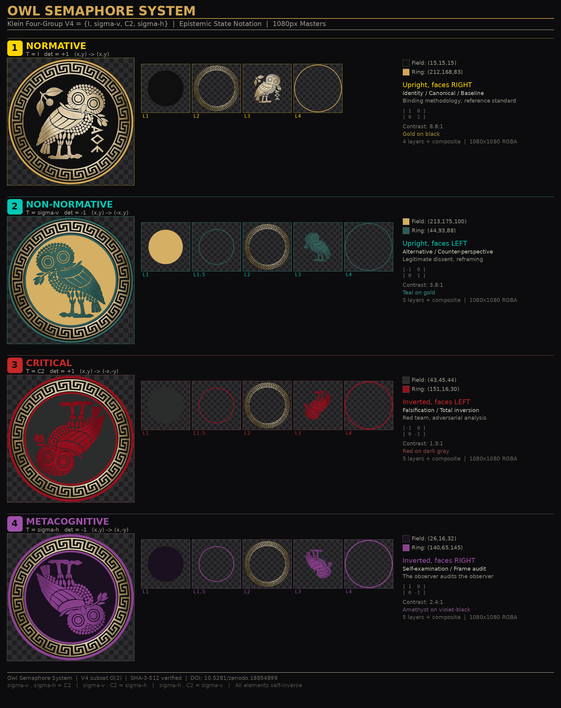

# OWL SEMAPHORE — SYSTEM SPECIFICATION
A finite algebra over epistemic states, implemented as a reproducible visual system with enforced invariants.
## Version 1.0
---

## 1. Statement of Intent

This document defines the Owl Semaphore as a formal epistemic system grounded in mathematics, perception, and reproducible graphical structure.

This is not a taxonomy of labels. It is a closed algebra over epistemic states, mapped into a constrained visual system.

The objective is to create a system that is:

- mathematically coherent
- visually invariant
- epistemically meaningful
- operationally reproducible
- resistant to ambiguity and drift

---

## 2. Mathematical Foundation

### 2.1 Group Definition

The Owl Semaphore is defined as the Klein four-group:

$$
V_4 = \{I, \sigma_v, C_2, \sigma_h\}
$$

This is a finite subgroup of the orthogonal group \(O(2)\).

### 2.2 Elements

| State | Operator | Mapping | Determinant |
|------|--------|--------|------------|
| NORMATIVE | I | (x,y) → (x,y) | +1 |
| NON-NORMATIVE | σᵥ | (x,y) → (-x,y) | -1 |
| CRITICAL | C₂ | (x,y) → (-x,-y) | +1 |
| METACOGNITIVE | σₕ | (x,y) → (x,-y) | -1 |

### 2.3 Closure

The system is closed under composition:

σᵥ ∘ σₕ = C₂  
σᵥ ∘ C₂ = σₕ  
σₕ ∘ C₂ = σᵥ

Each element is its own inverse:

$$
g^2 = I
$$

### 2.4 Interpretation

This closure is not decorative. It enforces that all epistemic transitions remain inside a defined state space.

---

## 3. State vs Process

### 3.1 Discrete States

The four owls represent discrete epistemic states:

- identity
- reflection
- inversion
- frame inversion

### 3.2 Continuous Process

Not all operations belong to the state system.

### 3.3 The 31° Rotation

The measured ~31° rotation is not part of V₄.

- it is not closed
- repeated composition does not return to the set

It represents **process**, not state.

### 3.4 Principle

States classify position.  
Processes move between positions.

---

## 4. Epistemic Model

### 4.1 Core Structure

The system separates three levels:

1. object of analysis  
2. observer  
3. evaluative frame

### 4.2 State Mapping

| State | Meaning |
|------|--------|
| NORMATIVE | baseline framework |
| NON-NORMATIVE | reflected interpretation |
| CRITICAL | inverted assumptions |
| METACOGNITIVE | observer audit |

### 4.3 Critical Distinction

The system is only valid if these states are not conflated.

---

## 5. Physical Grounding

The system is grounded in observable behavior.

### 5.1 Canonical Example

The METACOGNITIVE state is physically instantiated by:

- searching a space normally
- failing to detect a target
- inverting the viewing frame

### 5.2 Interpretation

The object does not change.  
The observer does not change.  
The frame changes.

---

## 6. Visual System Mapping

### 6.1 Shared Geometry

All owls share:

- identical center
- identical radial structure
- identical meander ring

### 6.2 Transform Consistency

Each owl is derived from the normative form by a valid element of V₄.

No arbitrary transformations are permitted.

### 6.3 Invariants

- geometry is fixed  
- center is fixed  
- ring structure is fixed  

---

## 7. Color System

Each state is assigned a distinct color space region:

- gold → normative authority
- teal → analytical reflection
- red → adversarial inversion
- amethyst → introspective analysis

### 7.1 Constraint

Color is semantic, not decorative.

---

## 8. Integrity Model

All assets must satisfy:

- reproducibility from layers
- RGBA transparency correctness
- cryptographic verification (SHA-3-512)

### 8.1 Principle

An asset is not valid because it looks correct.  
It is valid because it verifies.

---

## 9. File and System Architecture

### 9.1 Structure

OWL-SEMAPHORE/
├── OWL-SEMAPHORE-SYSTEM.md
├── INTEGRITY-MANIFEST.md
├── OWL-1-NORMATIVE/
├── OWL-2-NON-NORMATIVE/
├── OWL-3-CRITICAL/
└── OWL-4-METACOGNITIVE/

### 9.2 Separation of Concerns

- system rules live here
- state rules live in owl-specific files

---

## 10. Interpretation Doctrine

### 10.1 The System Encodes Position, Not Truth

The Owl Semaphore does not assert correctness.

It encodes:

- how something is being evaluated
- not whether it is ultimately true

### 10.2 Misuse Condition

If the system is used to imply certainty rather than epistemic position, it is being used incorrectly.

---

## 11. Core Principle

This system is defined as:

A finite algebra over epistemic states, mapped into a visual system with strict invariants.

---

## 12. Closing Statement

The Owl Semaphore is designed to make reasoning visible.

It enforces structure where ambiguity would otherwise dominate, and it preserves interpretability across transformation, disagreement, and self-examination.

It is not decoration.

It is a constraint system for thought.
## Standards

- NORMATIVE (NORM)
- NON-NORMATIVE (NONNORM)
- CRITICAL (CRIT)
- METACOGNITIVE (META)

## Release Location

assets/releases/540/

## Current Release Set

CRIT-composite-dark-540.png
CRIT-composite-transparent-540.png
CRIT-composite-white-540.png
META-composite-dark-540.png
META-composite-transparent-540.png
META-composite-white-540.png
NONNORM-composite-dark-540.png
NONNORM-composite-transparent-540.png
NONNORM-composite-white-540.png
NORM-composite-dark-540.png
NORM-composite-transparent-540.png
NORM-composite-white-540.png
