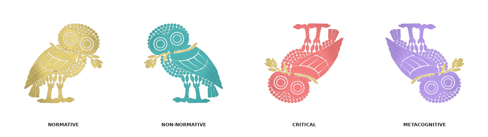

# OWL SEMAPHORE — SYSTEM SPECIFICATION
A finite algebra over epistemic states, implemented as a reproducible visual notation system with enforced invariants.

## Version 2.0.0-rc (release candidate)

> **Release-candidate notice.** This branch is the v2.0.0 release candidate. It promotes the owl-only visual master and the human-selected gold branch / olive heritage marker to the authoritative asset set, formalises the doctrine that the branch is part of the owl *before* the V₄ transforms (so it transforms with the owl rather than being a fixed decorative overlay), refines explanatory language carried over from v1.3.0-rc, repairs the reproducible PDF pipeline against the new asset set, and adds asset-level verification tests (V₄ transform fidelity on alpha geometry, palette correctness per state, NORMATIVE-not-red guardrail, and speckle/junk artifact check). **It does not change the V₄ algebra or the σₕ assignment for METACOGNITIVE.** No Zenodo upload, no release tag, and no merge has occurred for v2.0.0. The currently published Zenodo record remains v1.2.0 (DOI [10.5281/zenodo.19474599](https://doi.org/10.5281/zenodo.19474599)). The version DOI for v2.0.0 is `TBD_BY_ZENODO_ON_RELEASE`.

[](https://doi.org/10.5281/zenodo.19474599)
[](https://creativecommons.org/licenses/by/4.0/)

- **Currently published version DOI (v1.2.0):** [10.5281/zenodo.19474599](https://doi.org/10.5281/zenodo.19474599)
- **Concept DOI (all versions):** [10.5281/zenodo.19473697](https://doi.org/10.5281/zenodo.19473697)
- **Release-candidate version DOI (v2.0.0):** `TBD_BY_ZENODO_ON_RELEASE`
- **License:** [CC BY 4.0](https://creativecommons.org/licenses/by/4.0/)

## Why v2.0.0 is a major release

The v2.0.0 release is a **MAJOR** version bump in the project's semantic-versioning intent (MAJOR = algebra change *or* equivalent change to the authoritative artifact set that downstream citations must be aware of). The algebra is unchanged. The change that justifies MAJOR is the authoritative-asset replacement:

1. A new **visual master**: the v2 owl-only PNG lineage replaces the prior composite as the authoritative source.
2. **Owl-only doctrine**: the full Athena medallion, AOE letters, and surrounding coin decoration are removed from the mathematical master. They are not reintroduced.
3. **Human-selected gold branch / olive heritage marker** is now part of the source owl form *before* the V₄ transforms, and is transformed by the same V₄ operations as the owl. It is not a fixed decorative overlay.
4. A **publication pipeline** that regenerates the four state PDFs and the system / explanation PDFs against the v2 asset set, with the banner-tuple and asset-doctrine tests gating the build.

See [`ASSET-DOCTRINE.md`](ASSET-DOCTRINE.md) for the full doctrine and [`PROVENANCE.md`](PROVENANCE.md) for the AI-assisted-cleanup / Pixelmator Pro disclosure.

## Canonical Sentence Stack (v2.0.0-rc)

| Layer | Sentence | Use |
| --- | --- | --- |
| Formal | *A finite algebra over epistemic states, implemented as a reproducible visual notation system with enforced invariants.* | README, system spec, citation abstract |
| Operational | *A four-state visual system for marking how a claim, document, dataset, or finding should be evaluated before belief, challenge, or action.* | Explanation doc, public overview |
| Human | *Four owls tell the reader what kind of thinking they are looking at: standard, exploration, inversion, or self-audit.* | Story sections, teaching material |

See [`CHANGELOG.md`](CHANGELOG.md) for the per-version canonical sentence history.

## The Four States (v2.0.0-rc)

| State | Operator | Determinant | Quote (normative) | Standards register |
| --- | --- | --- | --- | --- |
| NORMATIVE | I | +1 | *"This is the standard."* | RFC 2119 MUST / SHALL |
| NON-NORMATIVE | σᵥ | −1 | *"This reflects the standard."* | Informative / Advisory (NOTE) |
| CRITICAL | C₂ | +1 | *"This inverts the standard."* | RFC 2119 MUST NOT / SHALL NOT |
| METACOGNITIVE | σₕ | −1 | **"The observer audits the frame."** | Epistemic / Framework (META) |

The METACOGNITIVE phrasing introduced in v1.3.0-rc is preserved. *"This audits the standard"* remains deprecated because it failed to express *thinking examining its own frame*. See [`OWL-4-METACOGNITIVE.md`](OWL-4-METACOGNITIVE.md) §1 and [`OWL-SEMAPHORE-EXPLANATION.md`](OWL-SEMAPHORE-EXPLANATION.md) for the warmer explanatory variant *"Thinking examines its own frame."*

## Group-theoretic scope (no overclaim)

The four transforms form a **finite subgroup of O(2) isomorphic to the Klein four-group V₄** (equivalently the dihedral group D₂). The system is **not** O(2); it is a four-element subgroup. The complete state algebra is exactly: NORMATIVE *I* (x, y) ↦ (x, y); NON-NORMATIVE σᵥ (x, y) ↦ (−x, y); CRITICAL C₂ (x, y) ↦ (−x, −y); METACOGNITIVE σₕ (x, y) ↦ (x, −y). There is no formal-verification claim — invariants are enforced by tests, not by a proof assistant.

## Palette (v2.0.0-rc, normative)

| State | Hex |
| --- | --- |
| NORMATIVE | `#D8B760` (warm gold) |
| NON-NORMATIVE | `#2F8C8C` (teal) |
| CRITICAL | `#DA3741` (B alert red balanced) |
| METACOGNITIVE | `#8F75BF` (amethyst) |

**Hard rules:**

- CRITICAL red is reserved for the CRITICAL state only.
- NORMATIVE must never be red — NORMATIVE is gold.
- These rules are tested by `tests/test_v2_assets.py`.

## Accessibility — Color Is Not the Only Carrier

Every state's identity is recoverable from three redundant channels: **color + orientation + textual label/context**. This is the project's mitigation for color vision deficiency (~8% of males, ~0.5% of females of Northern-European descent) and grayscale rendering, in line with [WCAG 2.2 SC 1.4.1 (Use of Color)](https://www.w3.org/WAI/WCAG21/Understanding/use-of-color.html). The CRITICAL state's intentionally low red-on-red contrast is the most acute test of the rule; red alone never carries CRITICAL identity. See [`OWL-SEMAPHORE-SYSTEM.md`](OWL-SEMAPHORE-SYSTEM.md) §7.2.

## Citation

If you use the Owl Semaphore Badge System, please cite the most recently published version DOI (currently v1.2.0):

> Balboa, Carey James. *Owl Semaphore Badge System* (v1.2.0). Zenodo. https://doi.org/10.5281/zenodo.19474599

After v2.0.0 is published on Zenodo, replace the version DOI with the minted v2.0.0 DOI (currently `TBD_BY_ZENODO_ON_RELEASE`). Machine-readable citation metadata is in [`CITATION.cff`](CITATION.cff).

## Reproducing the PDFs

All six PDFs (system spec + four state specs + explanation) regenerate from the markdown sources with a single command:

```bash
make pdfs
# or, equivalently:
python3 generate_pdfs.py
```

`make pdfs` produces page-one banner-tuple-bearing PDFs with embedded PDF metadata (Title, Author, Subject, Keywords, Producer, Version), a contact-sheet header, a classification ledger back page, and per-page owl headers. The pipeline uses pandoc → Typst (via the `typst` Python package). See [`Makefile`](Makefile) for additional targets:

- `make hashes` — recompute SHA-3-512 hashes for committed PDFs and release assets
- `make manifest` — rewrite `INTEGRITY-MANIFEST.md` integrity records from current hashes
- `make test` — run banner-tuple PDF integrity test **and** v2 asset doctrine tests
- `make tiffs` — assemble the v2 multi-page master TIFFs
- `make clean` — remove generated `.typ` intermediates

## Repository Layout

```
owl-semaphore/
├── README.md
├── ASSET-DOCTRINE.md                    (new in v2.0.0-rc)
├── PROVENANCE.md                        (new in v2.0.0-rc)
├── CHANGELOG.md
├── OWL-SEMAPHORE-SYSTEM.md
├── OWL-SEMAPHORE-EXPLANATION.md
├── OWL-1-NORMATIVE.md
├── OWL-2-NON-NORMATIVE.md
├── OWL-3-CRITICAL.md
├── OWL-4-METACOGNITIVE.md
├── INTEGRITY-MANIFEST.md
├── RELEASE-HASHES.txt
├── CITATION.cff
├── .zenodo.json
├── Makefile
├── generate_pdfs.py
├── scripts/
│   ├── compute_hashes.py
│   ├── update_manifest.py
│   └── assemble_owl_tiff.py             (new in v2.0.0-rc)
├── tests/
│   ├── test_banner_tuple.py
│   └── test_v2_assets.py                (new in v2.0.0-rc)
└── assets/
    ├── v2/
    │   ├── transparent-1080/            (v2 authoritative masters)
    │   ├── transparent-540/             (v2 derived 540 PNGs)
    │   ├── masters/                     (v2 multi-page TIFFs)
    │   ├── proofs/                      (v2 contact sheet + per-state palettes)
    │   ├── metrics/                     (gold branch transform metrics)
    │   └── SHA256SUMS.candidate.txt
    ├── exports/                         (v1.3 lineage; retained)
    ├── layers/                          (v1.3 lineage; retained)
    ├── masters/                         (v1.3 lineage; retained)
    ├── proofs/                          (v1.3 lineage; retained)
    └── releases/                        (v1.3 lineage; retained)
```

## Related Resources

- DNS Tool Owl Semaphore page: https://dnstool.it-help.tech/owl-semaphore
- DNS Tool confidence framework: https://dnstool.it-help.tech/confidence
- DNS Tool corpus (epistemic classification legend): https://dnstool.it-help.tech/corpus
- DNS Tool publications: https://dnstool.it-help.tech/publications

## Standards

- NORMATIVE (NORM)
- NON-NORMATIVE (NONNORM)
- CRITICAL (CRIT)
- METACOGNITIVE (META)

## Authoritative v2 Asset Set

```
assets/v2/transparent-1080/NORMATIVE-human-gold-branch-transparent-1080.png
assets/v2/transparent-1080/NON-NORMATIVE-human-gold-branch-transparent-1080.png
assets/v2/transparent-1080/CRITICAL-human-gold-branch-transparent-1080.png
assets/v2/transparent-1080/METACOGNITIVE-human-gold-branch-transparent-1080.png
assets/v2/transparent-540/NORMATIVE-human-gold-branch-transparent-540.png
assets/v2/transparent-540/NON-NORMATIVE-human-gold-branch-transparent-540.png
assets/v2/transparent-540/CRITICAL-human-gold-branch-transparent-540.png
assets/v2/transparent-540/METACOGNITIVE-human-gold-branch-transparent-540.png
assets/v2/masters/NORMATIVE-V2-MASTER-1080.tiff
assets/v2/masters/NON-NORMATIVE-V2-MASTER-1080.tiff
assets/v2/masters/CRITICAL-V2-MASTER-1080.tiff
assets/v2/masters/METACOGNITIVE-V2-MASTER-1080.tiff
```

<script type="application/ld+json">
{
  "@context": "https://schema.org",
  "@type": "SoftwareSourceCode",
  "name": "Owl Semaphore Badge System",
  "version": "2.0.0-rc",
  "license": "https://creativecommons.org/licenses/by/4.0/",
  "codeRepository": "https://github.com/IT-Help-San-Diego/owl-semaphore",
  "datePublished": "2026-04-07",
  "dateModified": "2026-05-17",
  "identifier": [
    "https://doi.org/10.5281/zenodo.19474599",
    "https://doi.org/10.5281/zenodo.19473697"
  ],
  "sameAs": "https://doi.org/10.5281/zenodo.19474599",
  "programmingLanguage": "Not applicable",
  "author": {
    "@type": "Person",
    "name": "Carey James Balboa",
    "identifier": "https://orcid.org/0009-0000-5237-9065"
  },
  "description": "A finite algebra over epistemic states, implemented as a reproducible visual notation system with enforced invariants. Four-state classification (NORMATIVE, NON-NORMATIVE, CRITICAL, METACOGNITIVE) for DNS Tool documentation and related research artifacts. v2.0.0-rc is a release candidate; the version DOI for v2.0.0 will be minted by Zenodo on release. v2.0.0 promotes the owl-only visual master and the human-selected gold branch as the authoritative artifact set.",
  "keywords": [
    "Owl Semaphore",
    "DNS Tool",
    "visual epistemic notation",
    "Klein four-group",
    "V4",
    "classification system",
    "documentation",
    "epistemology",
    "metacognition",
    "accessibility"
  ],
  "releaseNotes": "v2.0.0-rc — major release: owl-only authoritative visual master; human-selected gold branch / olive heritage marker applied before the V4 transforms so it transforms with the owl; v2 asset doctrine and provenance disclosure files added; PDF pipeline switched to the v2 asset set; asset doctrine test suite added (V4 transform fidelity on alpha geometry, palette correctness, NORMATIVE-not-red guardrail, speckle artifact check); multi-page TIFF masters generated. V4 algebra and sigma_h assignment unchanged.",
  "isAccessibleForFree": true
}
</script>
